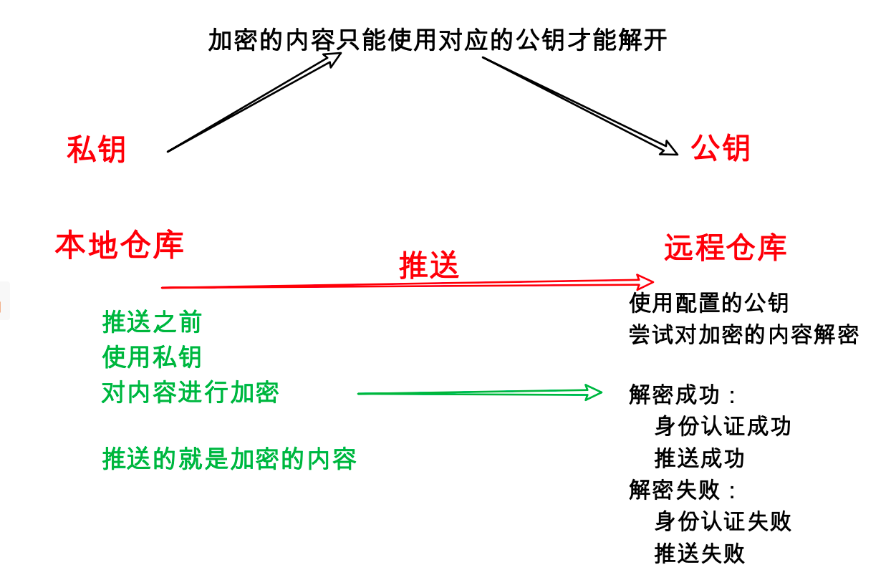
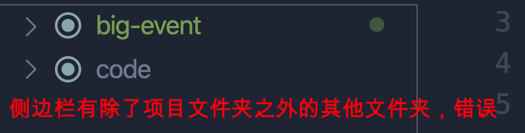
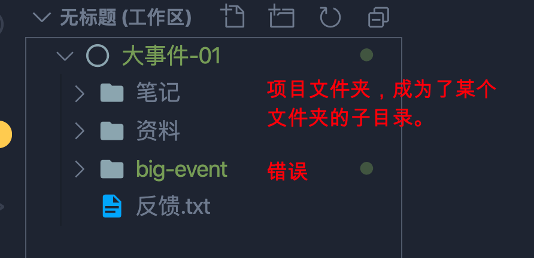
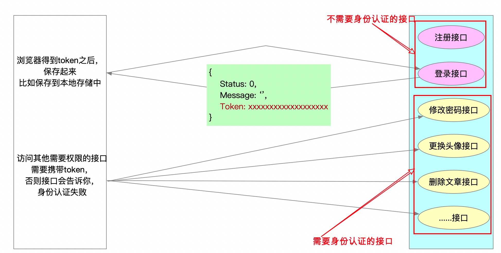

# 大事件-01

## 回顾Git的使用

### 记录每次的变更

- 工作区 --> 暂存区
    - `git add .`    /   `git add  文件 文件夹 ....`
- 工作区 --> 暂存区/本地仓库
    - 前提条件：文件曾经被添加到暂存区或提交到仓库
    - `git commit -a -m '提交说明'`
- 暂存区 --> 本地仓库
    - `git commit -m '提交说明'`  /  `git commit 文件 文件夹... -m '提交说明'`

> 只有被提交到本地仓库，才会形成一个版本（有版本号可查）

### 回退

- 暂存区 --> 工作区
    - `git checkout .`   /   `git checkout 文件  .....`
- 仓库 --> 暂存区
    - `git reset .`
- 仓库 --> 暂存区/工作区
    - `git reset --hard`
- 只把某个文件回退到历史的某个版本
    - `git checkout 版本号 文件名`

### 分支

- 查看分支
    - `git branch`
    - `git branch -a` （查看到本地和远程的分支）
- 创建分支
    - `git branch 分支名`
- 切换分支
    - `git checkout 分支名`
- 创建并直接切换分支
    - `git checkout -b 分支名`
- 合并分支
    - `git merge 分支名`
- 删除分支
    - `git branch -d 分支名`

### 远程仓库




- ssh配置
    - 生成秘钥命令：`ssh-keygen -t rsa -C "你的邮箱"`
    - ssh秘钥，一台电脑只需要配置一次
- 推送本地仓库 --> 远程仓库
    - `复制远程仓库的ssh地址`
    - `git remote add 别名  远程仓库地址`
    - 如果你的远程仓库不是空的，需要先拉取，`git pull 别名 master --rebase`
    - 首次推送，`git push -u 别名 分支名`
    - 如果不是首次推送了，可以直接 `git push`
- 克隆远程仓库 --> 本地
    - `git clone 仓库的ssh地址`
- 多人协作
    - 管理员 邀请 开发者 共同来开发
    - 开发者 需要 同意
    - 多人协作开发的时候，原则是先拉后推。

## 项目说明和演示

1. 线上 DEMO 项目地址：http://www.liulongbin.top:8086/
2. 项目的 API 接口地址： https://www.showdoc.cc/escook?page_id=3707158761215217

> 项目请求根路径：http://www.liulongbin.top:3007

## 准备工作

- 创建一个文件夹，（项目根目录），项目的所有代码都放到这个文件夹
- 把资料中的基本代码里面的文件拷贝到项目目录中
- 使用Git来管理项目（以后做完一个功能，提交一次；）
    - git init
    - git add .
    - git commit -m '提交了初始的代码'

## 模拟服务器的环境

- 开发完成，最终肯定要把项目发布到真正的服务器上。

- 所以，本地开发的时候，最好也使用服务器环境（模拟）。

- 好处是，项目发布到真正的服务器上的时候，不会出现这样或那样的问题。因为本地开发的时候，使用的也是服务器环境。

如何使用服务器环境

- 使用vscode插件 -- live server
    - 编辑器右键菜单中会出现 “Open With Liver Server”，点击它，可以预览页面
    - 特点：页面改变之后，浏览器会自动刷新
- 使用vscode插件 -- preview on web server
    - 右键菜单出现 “vscode-preview-server:Launch on browser”，点击它可以预览

**使用上述两个插件，硬性要求**：

vscode 编辑器侧边栏（文件区域）不能有其他文件夹，只能有你的项目文件夹。

反例1：



反例2：



## 登录和注册

### 新建分支

每个功能，最好创建一个新的分支

```bash
# 创建并切换分支
git checkout -b login

# 也可以先创建分支，然后在切换分支
git branch login
git checkout login
```

### 新建login.html

在项目根目录里面创建了`login.html`

创建 big-event/assets/`css/login.css`

创建 big-event/assets/`js/login.js`

### 加载所需的文件

```html
<!-- login.html head区 -->
	<!-- 加载第三方的 layui.css -->
    <link rel="stylesheet" href="/assets/lib/layui/css/layui.css">
    <!-- 加载自己的css -->
    <link rel="stylesheet" href="/assets/css/login.css">
    <!-- 加载jquery.js -->
    <script src="/assets/lib/jquery.js"></script>
    <!-- 加载layui.all.js -->
    <script src="/assets/lib/layui/layui.all.js"></script>
    <!-- 加载自己的js -->
    <script src="/assets/js/login.js"></script>
```

> 原则是，先加载第三方的css和js。后加载自己的css和js

> 路径中的  /  表示项目根目录 （big-event）,必须使用服务器环境，才能使用 / 

### logo区布局

```html
<!-- logo盒子 -->
    <div class="logo">
        
    </div>
```

```css
* {
    margin: 0;
    padding: 0;
}

html, body {
    width: 100%;
    height: 100%;
}

body {
    background: url("/assets/images/login_bg.jpg") no-repeat;
    background-size: cover;
    overflow: hidden;
}

.logo {
    padding: 20px 0 0 40px;
}
```

### 表单区布局

```html
<!-- 登录的盒子 -->
    <div class="login">
        <!-- 盒子的标题 -->
        <div class="title">
            
        </div>
        <!-- 表单区 -->
        <form class="layui-form">
            <!-- 第一行：账号 -->
            <div class="layui-form-item">
                <i class="layui-icon layui-icon-username"></i>
                <input type="text" name="title" required lay-verify="required" placeholder="请输入账号" autocomplete="off"
                    class="layui-input">
            </div>
            <!-- 第二行：密码 -->
            <div class="layui-form-item">
                <i class="layui-icon layui-icon-password"></i>
                <input type="text" name="title" required lay-verify="required" placeholder="请输入密码" autocomplete="off"
                    class="layui-input">
            </div>
            <!-- 第三行：按钮 -->
            <div class="layui-form-item">
                <button class="layui-btn layui-btn-fluid layui-bg-blue" lay-submit lay-filter="formDemo">登录</button>
            </div>
            <!-- 第四行：去注册 -->
            <div class="layui-form-item">
                <a href="javascript:">去注册</a>
            </div>
        </form>
    </div>

    <!-- 注册的盒子 -->
    <div class="register">
        <!-- 盒子的标题 -->
        <div class="title">
            
        </div>
        <!-- 表单区 -->
        <form class="layui-form">
            <!-- 第一行：账号 -->
            <div class="layui-form-item">
                <i class="layui-icon layui-icon-username"></i>
                <input type="text" name="title" required lay-verify="required" placeholder="请输入账号" autocomplete="off"
                    class="layui-input">
            </div>
            <!-- 第二行：密码 -->
            <div class="layui-form-item">
                <i class="layui-icon layui-icon-password"></i>
                <input type="text" name="title" required lay-verify="required" placeholder="请输入密码" autocomplete="off"
                    class="layui-input">
            </div>
            <!-- 第三行：确认密码 -->
            <div class="layui-form-item">
                <i class="layui-icon layui-icon-password"></i>
                <input type="text" name="title" required lay-verify="required" placeholder="请确认密码" autocomplete="off"
                    class="layui-input">
            </div>
            <!-- 第四行：按钮 -->
            <div class="layui-form-item">
                <button class="layui-btn layui-btn-fluid layui-bg-blue" lay-submit lay-filter="formDemo">注册</button>
            </div>
            <!-- 第五行：去登录 -->
            <div class="layui-form-item">
                <a href="javascript:">去登录</a>
            </div>
        </form>
    </div>
```

```css
/*登录的盒子和注册的盒子*/
.login, .register {
    width: 400px;
    height: 310px;
    background-color: #fff;
    position: absolute;
    left: 50%;
    top: 50%;
    transform: translate(-50%, -50%);
}

/* 先隐藏注册的盒子 */
.register {
    display: none;
}

.title {
    margin: 18px auto;
    text-align: center;
}

/*表单区*/
.layui-form {
    padding: 0 30px;
}

.layui-form a {
    display: flex;
    justify-content: flex-end; /*让元素在盒子的右侧显示*/
}

/*字体图标调整*/
.layui-form-item {
    position: relative;
}

.layui-form-item .layui-icon {
    position: absolute;
    top: 11px;
    left: 8px;
}

input.layui-input {
    padding-left: 28px;
}
```

```js
$(function () {
    // 入口函数
    // --------------------------  切换登录和注册的盒子 -------------
    // 点击去注册
    $('.login a').click(function () {
        $('.login').hide().next().show();
    });

    // 点击去登录
    $('.register a').click(function () {
        $('.register').hide().prev().show();
    });

});
```

> Git提交了一次

### 实现注册功能

```js
// --------------------- 完成注册功能 ---------------------
    $('.register form').on('submit', function (e) {
        e.preventDefault();
        // 获取表单中的数据
        let data = $(this).serialize(); // serialize是根据表单各项的name属性获取值的，所以要检查表单各项的name属性
        // 发送ajax请求到接口，完成注册
        $.ajax({
            type: 'POST',
            url: 'http://www.liulongbin.top:3007/api/reguser',
            data: data,
            success: function (res) {
                alert(res.message);
                if (res.status === 0) {
                    // 注册成功，让登陆的盒子显示
                    $('.register').hide().prev().show();
                }
            }
        });
    });
```

>  注册功能可以实现，但是缺少表单验证。

> Git，提交。完成了注册功能。 `git commit -a -m '完成了注册功能'`

### layui表单验证模块

layui模块的使用步骤：

1. 加载模块（得到一个JS对象）`let form = layui.form;`
2. 使用模块提供的方法

使用表单模块中的表单验证方法

```js
// 加载模块
let form = layui.form;
// 调用方法，定义验证规则
form.verify({
    // 对象里面的每个键值对，就是一个自定义的验证规则
    // 写法一，使用数组
    // 验证规则: [/正则表达式/,  '验证失败时的提示']
    
    
    // 写法二：使用函数
    // 验证规则： function (valeu) {
    //      valeu 表示输入框输入的值
    //      return '失败后的提示'
	// }
});
```

我们的项目 login.js

```js
// -----------------------------   表单验证  --------------
// 1. 加载表单（form）模块
let form = layui.form;
// 2. 使用form.verify()方法实现表单验证
form.verify({
    // 第一个验证规则，验证密码长度必须是6~12位
    // key: value
    // 验证规则: array|function
    // pwd: ['正则', '验证不通过时的提示'],
    // pwd: [/^\S{6,12}$/, '密码长度必须是6~12位，并且不能有空格']
    pwd: function (value) {
        // value表示使用验证规则的输入框的值
        if (!/^\S{6,12}$/.test(value)) {
            return '密码长度必须是6~12位，并且不能有空格';
        }
    },
    // 验证两次密码
    repwd: function (value) {
        // value 表示确认密码
        let pwd = $('input[name="password"]').val().trim(); // 获取密码
        if (value !== pwd) {
            return '两次密码不一致';
        }
    }
});
```

login.html页面中，表单元素使用验证规则：

```html
<!-- 第二行：密码 -->
<div class="layui-form-item">
    <i class="layui-icon layui-icon-password"></i>
    <input type="text" name="password" required lay-verify="required|pwd" placeholder="请输入密码" autocomplete="off"
           class="layui-input">
</div>
```

```html
<!-- 第三行：确认密码 -->
<div class="layui-form-item">
    <i class="layui-icon layui-icon-password"></i>
    <input type="text" required lay-verify="required|pwd|repwd" placeholder="请确认密码" autocomplete="off"
           class="layui-input">
</div>
```

> **千万注意**：想要实现表单验证，登录按钮必须有 `lay-submit` 属性

> Git 提交。git commit -a -m '完成了注册时的表单验证'

### 使用layer模块实现弹出层效果

使用模块：

1. 加载模块  `let layer = layui.layer;`
2. 调用方法 `layer.msg(提示信息)`

具体，在login.js中，先加载模块，然后注册的失败，使用弹出层。

```js
let layer = layui.layer; // 加载弹出层模块
// --------------------- 完成注册功能 ---------------------
$('.register form').on('submit', function (e) {
    e.preventDefault();
    // 获取表单中的数据
    let data = $(this).serialize(); // serialize是根据表单各项的name属性获取值的，所以要检查表单各项的name属性
    // 发送ajax请求到接口，完成注册
    $.ajax({
        type: 'POST',
        url: 'http://www.liulongbin.top:3007/api/reguser',
        data: data,
        success: function (res) {
            // alert(res.message);
            layer.msg(res.message);
            if (res.status === 0) {
                // 注册成功，让登陆的盒子显示
                $('.register').hide().prev().show();
            }
        }
    });
});

```

> Git提交。 `git commit -a -m '使用layer模块优化注册的弹出层'`

### 实现登录功能

> 自行修改表单项的name属性值。

```js
// --------------------------  完成登录功能 ---------------------------
$('.login form').on('submit', function (e) {
    e.preventDefault();
    // 获取账号和密码
    // 提交给接口，完成登录。登录成功，跳转到 index.html （index.html是项目的首页面）
    $.ajax({
        type: 'POST',
        url: 'http://www.liulongbin.top:3007/api/login',
        data: $(this).serialize(), // 检查表单各项的name属性值
        success: function (res) {
            layer.msg(res.message);
            if (res.status === 0) {
                // 登录成功，跳转到index.html
                location.href = '/index.html';
            }
        }
    });
})
```

> Git提交， `git commit -a -m '完成了登录代码'`

### JWT验证机制原理

JWT（json web token），是一种前后端分离项目的常用身份认证机制。

原理图：



项目中，登录成功之后，把token保存到本地存储中：

```js
// --------------------------  完成登录功能 ---------------------------
$('.login form').on('submit', function (e) {
    e.preventDefault();
    // 获取账号和密码
    // 提交给接口，完成登录。登录成功，跳转到 index.html （index.html是项目的首页面）
    $.ajax({
        type: 'POST',
        url: 'http://www.liulongbin.top:3007/api/login',
        data: $(this).serialize(), // 检查表单各项的name属性值
        success: function (res) {
            layer.msg(res.message);
            if (res.status === 0) {
                // 登录成功，先保存token（令牌）---------------------
                localStorage.setItem('token', res.token);
                // 登录成功，跳转到index.html
                location.href = '/index.html';
            }
        }
    });
})
```

> Git提交， `git commit -a -m '登录成功记录了token'`